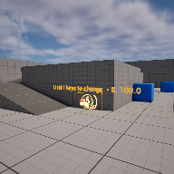

# Project Name  MetaSoundExample

## Description

A github repository for the in class demonstration code.   
 
## Usage
Clone, or download the zip, to a local directory. Open in Unreal Engine 5.4 or newer

## Attributions

Based on Unreal Engine documentation notes at 

( https://dev.epicgames.com/documentation/en-us/unreal-engine/creating-procedural-music-with-metasounds )

